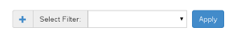

Filters
========

One of the most asked for features in NSTI and even any SNMP handling is Filters.  Check here on how to use them in the best way.

Filtering SNMP traps with NSTI
-------------------------------

The biggest addition that was made to NSTI 3.0 is that you can now create filters than can be applied to the main traplist.  This allows you to check specific columns and values to be able to understand the SNMP data you have recieved.

Here is the Filter page where you can create, edit and delete filters:

.. image:: filtermain.png
	:align: center

Adding, Editing and Deleting
-----------------------------

This page is designed to give you full control of your filters and to make it much faster.  Here is and example of a new filter creation window.  You can select the item you want to be filtered, the comparison and the value to filter against:

.. image:: filteraddex.png
	:align: center

To edit an existing filter all you have to do is select a single filters' checkbox and click the pen icon.  This will allow you to change anything in the filter other than the title.

You can also add new filters from the traplist where they are applied:

Just click the plus sign to add a new filter and you will see the exact same window that you use to add a filter from the filter page.  Once you select add filter you will be able to choose it from the dropdown menu.

Applying Filters to the Traplist
---------------------------------

Once you have your filters made navigate back to the traplist page.  Now all you have to do to apply it is use the 'Select Filter' dropdown and select the filter you want to apply.  Once a filter has been applied you will see a green tag in the left side above the trap table.  This tag means that the filter you selected and applied is currently active on the traplist page.  To remove a filter tag simply click the 'X' on the tag to delete it.

.. image:: traplistApplyFilter.png
	:align: center

| As you can see above the table has been filtered with the following:
| 	Hostname 	Contains	.41
|	Severity	Contains	critical

If you have multiple filters then you can apply them on top of each other to get a more specific trap table.  There is no limit to how many filters you can apply at one time, but you can always create a filter with multiple specifications.
