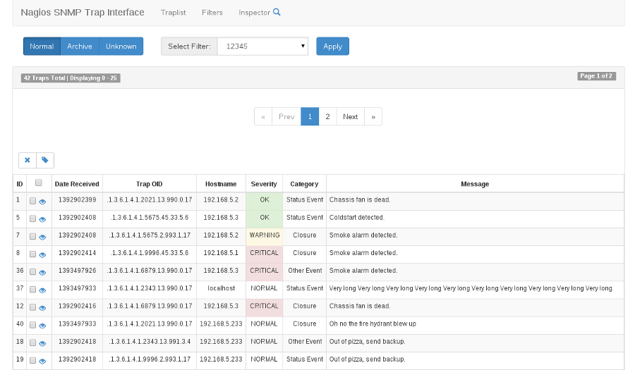
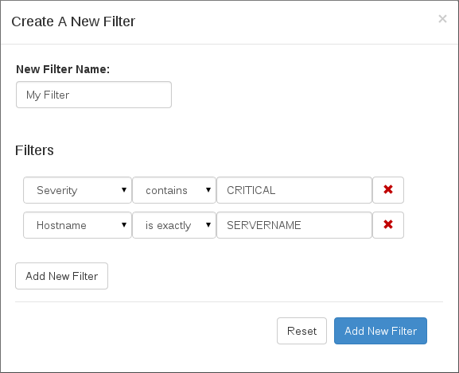

Introduction
============

Welcome to the official documentation for NSTI 3.0.  You can find all the information, documentation and 'how-to' guides on NSTI here.

What is NSTI?
-------------
NSTI stands for Nagios SNMP Trap Interface.  First and foremost let's talk about SNMP:
	Simple Network Management Protocol (SNMP)

This is a protocol used in network management to collect information and to configure all varieties of network devices such as servers, routers, switches and printers on an Internet Protocol (IP) network.  SNMP creates packets of data called traps, which NSTI collects and displays in a user friendly method.  It also allows the user to interact with the traps they recieve in a way that wouldn't normally be possible other than reading the trap data. 

Here is an example of the main page view with traps in main trap table:

*In this example you can see every recieved trap and apply the filters you created to the table*

Why use NSTI?
-------------
Collecting SNMP data can be a daunting task and without a proper user interface it can be even more difficult.  Some do not prefer to use SNMP because of this reason and NSTI is designed to make SNMP a useful and informative tool without any further engineering.  This is achieved by a smart installer, a clean user interface using bootstrap and a way to collect, filter and manage all the SNMP traps.

What's new in NSTI 3.0?
-----------------------
Since the previous version of NSTI there have been 2 large aditions
        | Trap Filtering 
        | Trap Inspector

The Inspector allows a user to view a specific trap metric and match them with other traps and display data for comparison. filtering is done by creating a filter with data specifics, such as the following example:

This template with a few example inputs
        | Trap OID **is exactly**	  1.3.6.1.4.1.2681.1.2.102
        | Date     **is greater than**     01/01/2014
        | Category **contains**		  Status Event

Using filters in this manner will make sifting through traps a lot more convenient especially when you are getting a large number of traps on a large system.

.. note::

	Find out more about NSTI and naviagte through this documentation by using the index or by using the search feature.
